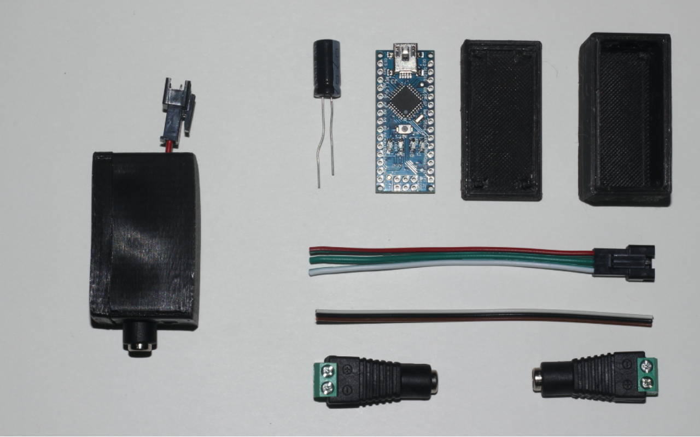

# A part from the [music to led project](https://github.com/tfrere/python-to-led-strip)

This repository is a part of the music to led project.
It provides a tool that allows you to send led strip frames to an arduino device using python.

## 1. Electronic scheme

### Component list

- 1x **Alim 5V 10A**
- 1x **Arduino nano or other**
- 1x **1000mu Capacitor** ( optional )
- 1x **Led strip female connector**

## 2. Test your device

Once the wiring is finished and your code uploaded, you can test it following these simple steps :

- 1. Connect the arduino to your computer through usb cable
- 2. run ./audio-2-led --list-devices and find the corresponding usb name
- 3. run ./audio-2-led --test-serial-device "YOUR CORRESPONDING USB NAME"

## 3. Make the 3d printed case

### Slicer settings

- Supports **No**
- Resolution **0.2**
- Infill **30-100%**

## Misc

### Led number limitation

It depends on two factors :

- Your board maximum baud rate
- Your led alimentation

For now and using the nano case, please consider not using more than 254 leds.

### Calculating led power consumtion

Each individual NeoPixel draws up to 60 milliamps at maximum brightness white (red + green + blue).

- 60 NeoPixels × 60 mA ÷ 1,000 = 3.6 Amps minimum
- 135 NeoPixels × 60 mA ÷ 1,000 = 8.1 Amps minimum
- 135 NeoPixels × 60 mA ÷ 1,000 / 2 (for each led to 125,125,125) = 4.05 Amps minimum
- 300 NeoPixels × 60 mA ÷ 1,000 = 18 Amps minimum
- 300 NeoPixels × 60 mA ÷ 1,000 / 2 (for each led to 125,125,125) = 9 Amps minimum

### OSX

Sometimes, the arduino nano is no recognized by OSX natively and you will have to install specific usb drivers to make it work.

brew tap adrianmihalko/ch340g-ch34g-ch34x-mac-os-x-driver https://github.com/adrianmihalko/ch340g-ch34g-ch34x-mac-os-x-driver
brew cask install wch-ch34x-usb-serial-driver
