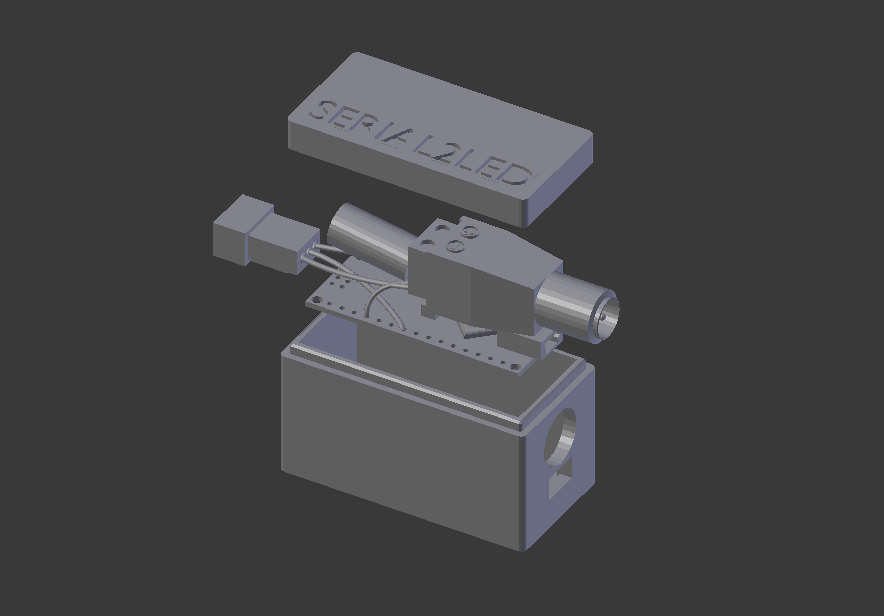

  

# A part from the [music to led project](https://github.com/tfrere/python-to-led-strip)

## Arduino part

In addition of the software, you need to create an arduino "serial to led" device.

As each led project has very specific needs, i kept this part as simple as possible.

Arduino code can be found [here](arduino/serial-case/serial-case.ino).

PS : For now, please consider not using more than 254 leds by arduino.

Once the wiring is finished and your code uploaded, you can test it following these simple steps :

- 1. Connect the arduino to your computer through usb cable
- 2. run ./audio-2-led --list-devices and find the corresponding usb name
- 3. run ./audio-2-led --test-serial-device "YOUR CORRESPONDING USB NAME"

### Advanced arduino device

If you need a complete packaged product, there is a more advanced version available in the [Arduino folder](/arduino/).

You will find :

- OBJ of 3d printed arduino cases
- Complete electronic scheme
- Device assembly and code upload tutorial

# Arduino part

### Component list

- 1x [**Alim 5V 10A**](https://www.amazon.fr/gp/product/B06XCMQ212/ref=ppx_yo_dt_b_asin_title_o00_s00?ie=UTF8&psc=1) _~25\$_
- 1x **Arduino nano or other** _~5\$_
- 1x **1000mu Capacitor** _~1\$_
- 1x [**Led strip female connector**](https://www.amazon.fr/BTF-LIGHTING-Connectors-WS2812B-WS2811-20pairs/dp/B01DC0KIT2) _~5\$_
- 1x **Led strip WS2812B** _~35\$_

**Estimated cost** _~75\$_

### Electronic scheme

### 3d printed case

Slicer settings

- Supports **No**
- Resolution **0.2**
- Infill **30-100%**

### Led number limitation

It depends on two factors :

- Your board maximum baud rate
- Your led alimentation

For now and using the nano case, please consider not using more than 254 leds.

## Calculating led power consumtion

Each individual NeoPixel draws up to 60 milliamps at maximum brightness white (red + green + blue).

- 60 NeoPixels × 60 mA ÷ 1,000 = 3.6 Amps minimum
- 135 NeoPixels × 60 mA ÷ 1,000 = 8.1 Amps minimum
- 135 NeoPixels × 60 mA ÷ 1,000 / 2 (for each led to 125,125,125) = 4.05 Amps minimum
- 300 NeoPixels × 60 mA ÷ 1,000 = 18 Amps minimum
- 300 NeoPixels × 60 mA ÷ 1,000 / 2 (for each led to 125,125,125) = 9 Amps minimum

## In some cases you will have to install USB drivers on OSX

brew tap adrianmihalko/ch340g-ch34g-ch34x-mac-os-x-driver https://github.com/adrianmihalko/ch340g-ch34g-ch34x-mac-os-x-driver
brew cask install wch-ch34x-usb-serial-driver
